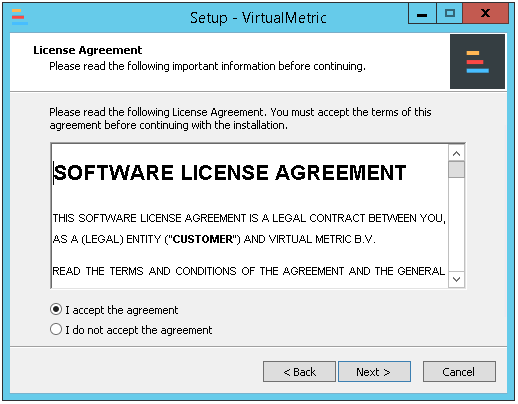
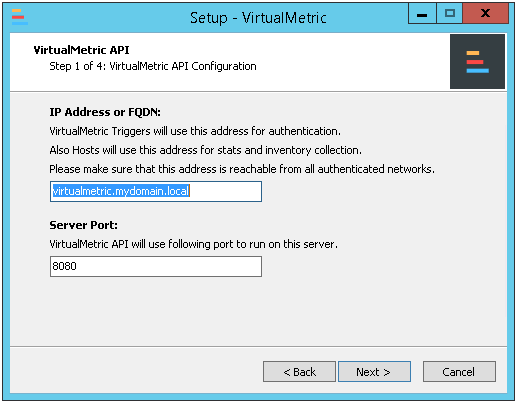
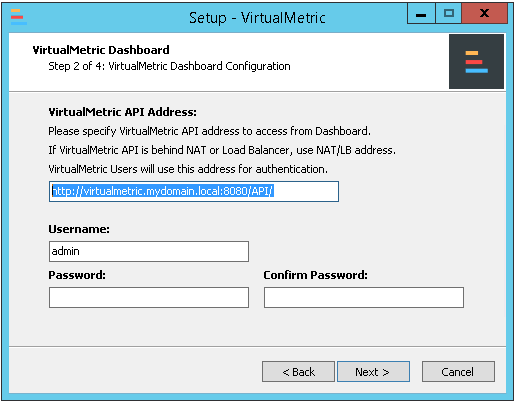
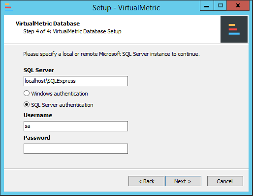
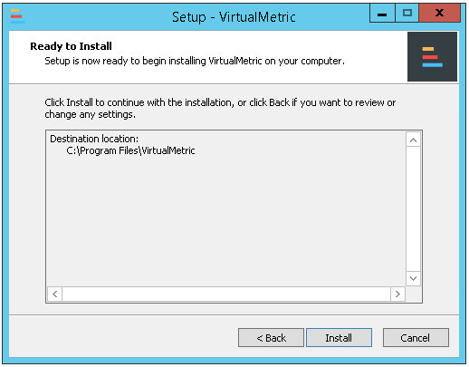
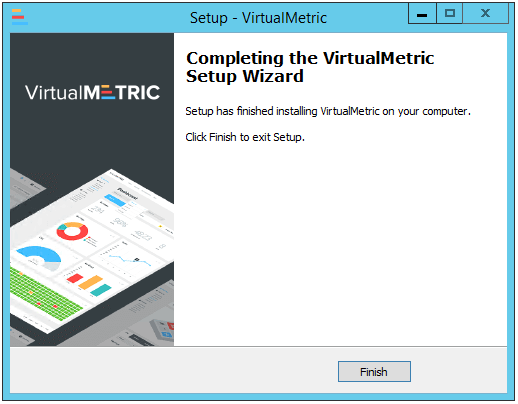

# Install a VirtualMetric Server

To install VirtualMetric software, you need to meet the following requirements:

* A **virtual machine** with at least **4 vCPU** and **minimum 8 GB RAM** memory.
* Windows Server **2019**, Windows Server 2022 or later.
* **100 GB Hard Disk Drive**

To store VirtualMetric Database, you need to meet the following requirements:

* A **virtual machine** with at least **8 vCPU** and **minimum 16 GB RAM** memory.
* Red Hat Enterprise Linux (RHEL) 7 or later / Debian 9 or later
* System Drive: **100 GB** Hard Disk Drive for OS and Database Software
* Data Drive: **100 GB** Hard Disk Drive minimum for basic data retention
* SingleStore Self Managed 8.0 or later / SingleStore Cloud

To access VirtualMetric Dashboard, you need a web browser. The following browsers are supported:

* Google Chrome 49 or later (recommended)
* Mozilla Firefox 45 or later
* Microsoft Edge 14 or later
* Opera 42 or later


When running VirtualMetric on a virtual machine, do not use dynamic resource allocation, but please make sure that full resources are available to the virtual machine at any time.


## **Hardware Requirements**

Hardware requirements for VirtualMetric mainly depend on the modules, intervals and history ranges. The following values are provided as reference for minimum requirements of VirtualMetric.

* Dual Core CPU
* 4096 MB Memory
* 100 GB Hard Disk Drive


When running VirtualMetric on a virtual machine, do not use dynamic resource allocation, but please make sure that full resources are available to the virtual machine at any time.


***

## **Software Requirements**

Before installing VirtualMetric on Windows Server, please make sure that you have following components on Windows Server:

* Microsoft PowerShell v4 or later
* .NET Framework 2.0 or later

***

## Running Setup Application

Installing VirtualMetric is easy and works like other Windows-based applications. To install VirtualMetric, run the installation setup program that you have downloaded.

1\.      Confirm the question of the Windows User Account Control with **Yes** to allow the program to install. The VirtualMetric installation dialog will guide you through the installation process.

<div align="left">

<figure><figcaption></figcaption></figure>

</div>

2\.      You will see Welcome Screen. Please click **Next** to continue.

<div align="left">

<figure><figcaption></figcaption></figure>

</div>

3\.      Accept the license agreement and click **Next**.

<div align="left">

<figure><figcaption></figcaption></figure>

</div>

4\.      In this step, you will configure VirtualMetric API settings. After filling the **required fields**, click N**ext**.

<div align="left">

<figure><figcaption></figcaption></figure>

</div>

* You can use either **IP address or FQDN** for VirtualMetric API connectivity. All servers will use this address for inventory and performance stats collection. So if you use FQDN, FQDN address should be resolved by all servers.
* By default, VirtualMetric API listens TCP **8080**. You can change following port configuration on this step to use different port. After you specify port address, VirtualMetric will setup its REST API with this port configuration.
* Setup will add firewall rule into Windows Firewall as part of the installation.


VirtualMetric API address should be reachable by all servers. Please visit [Firewall Configuration](../introduction/product-security.md#required-firewall-ports) section to make sure.


5\.      In this step, you will configure VirtualMetric Dashboard settings. After filling the required fields, click **Next**.

* Setup will enter VirtualMetric API address automatically. Clients will use this VirtualMetric API address when they connect to VirtualMetric Dashboard. If VirtualMetric API is in private network, you should type external address of VirtualMetric API here. Otherwise Clients will not be able to login dashboard due to unreachable network.
* Setup will require you to type a user name and password. You will use this username and password to login dashboard for the first time. Password must be at least 6 characters long.


Please write down your user name and password. Setup will not remind you at the end.



If you want to secure VirtualMetric Dashboard and VirtualMetric API connections with an SSL certificate, please visit [Setup SSL Certificate](maintenance.md#setup-ssl-certificate) section.


<div align="left">

<figure><figcaption></figcaption></figure>

</div>

6\.      In this step, you can enable Active Directory authentication for VirtualMetric Trigger. After filling the required fields, click **Next**.

* VirtualMetric uses scheduled task jobs for VirtualMetric Trigger. This user should also have administrator privileges on the local server. If you provide a domain user with necessary privileges on target servers, VirtualMetric will use this user to monitor servers. Please see [User Permissions](../modules-and-audit/virtualmetric-modules/bare-metal.md#windows-user-permissions) section for required privileges.
* If you want to use a domain user, please type its username as Domain\Username. User credentials will be used during setup to create VirtualMetric Trigger job and will not be stored anywhere.

<div align="left">

<figure><figcaption></figcaption></figure>

</div>

7\.      In this step, you will configure VirtualMetric Database settings. After filling the required fields, click **Next**.

* You should enter your Microsoft SQL Server Instance information and User information in this step.
* Our setup supports Windows and SQL Authentication methods.

<div align="left">

<figure><figcaption></figcaption></figure>

</div>

8\.      Review **setup location** and click **Next**.

<div align="left">

<figure><figcaption></figcaption></figure>

</div>

9\.      Click **Install** to start VirtualMetric installation.

<div align="left">

<figure><figcaption></figcaption></figure>

</div>

10\.      Click **Finish** to close Setup Wizard.

<div align="left">

<figure><figcaption></figcaption></figure>

</div>

***

## First Time Login

Once the VirtualMetric is installed, you can log in to the web interface In your browser and enter the **IP address** or **DNS name** of the computer where VirtualMetric is installed.\
\
If you are logged on VirtualMetric server, you can use following address.

```markup
http://localhost
```

After loading the VirtualMetric Dashboard, you will see following login screen. You can log in using the username and password that you provided on Setup Wizard. After you type your **username** and **password**, click to **Login** button to log in.

<div align="left">

<figure><figcaption></figcaption></figure>

</div>

When you log in for the first time, you will see Welcome Screen.

<div align="left">

<figure><figcaption><p>VirtualMetric Welcome Screen</p></figcaption></figure>

</div>

Please click **Go to Settings** button to navigate to Settings page. Now you can active the product to start monitoring.
