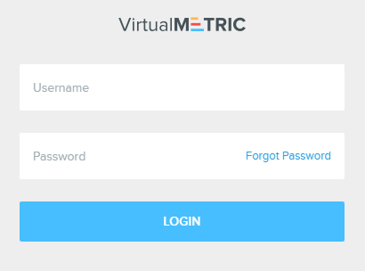

# Installing The VirtualMetric Server

To install the VirtualMetric software, the following requirements must be met:

* A **virtual machine** with at least **4 vCPU** and minimum **8 GB RAM** memory.
* Windows Server **2019**, **2022**, or later.
* **100 GB** Hard Disk Drive
* Microsoft Edge or Google Chrome should be installed on this Windows machine. (Internet Explorer is not supported by VirtualMetric).

To store a _VirtualMetric Database_, you need to meet the following requirements:

* A **virtual machine** with at least **8 vCPU** and minimum **16 GB RAM** memory.
* Operating System: Ubuntu 22.04 or later / Red Hat Enterprise Linux (RHEL) 7 or later / Debian 9 or later
* System Drive: **100 GB** Hard Disk Drive for OS and Database Software
* Data Drive: **100 GB** Hard Disk Drive minimum for basic data retention

On the Linux machine, the following CPU flags must be enabled for the _Clickhouse_ database to operate properly:

* adx
* avx
* avx2
* bmi1
* bmi2
* clmul
* fma
* pclmulqdq

    You can get the list of enabled CPU flags by running this command:\
    <code>sudo cat /proc/cpuinfo | grep flags | head -n 1 | tr ' ' '\n' | sort</code>


When running VirtualMetric on a virtual machine, do not use dynamic resource allocation, but make sure that full resources are available to the virtual machine at any time.


## Hardware Requirements

Hardware requirements for VirtualMetric mainly depend on the modules, intervals and history ranges. The following should serve as reference for the minimum requirements of VirtualMetric:

* Dual Core CPU
* 4096 MB Memory
* 100 GB Hard Disk Drive


When running VirtualMetric on a virtual machine, do not use dynamic resource allocation, but please make sure that full resources are available to the virtual machine at any time.


***

## Software Requirements

Before installing VirtualMetric on Windows Server, please make sure that you have following components on Windows Server:

* Microsoft PowerShell v4 or later
* .NET Framework 2.0 or later

***

## Running The Setup Application

Installing VirtualMetric is easy and works like any other Windows-based application. To install VirtualMetric, run the setup program you have downloaded.

1\.      Confirm the question about Windows User Account Control with **Yes** to allow the program to install. The VirtualMetric installation dialog will guide you through the process.

<div align="left">
<figure><figcaption></figcaption></figure>
</div>

2\.      You will see the Welcome Screen. Click **Next** to continue.

<div align="left">
<figure><figcaption></figcaption></figure>
</div>

3\.      Accept the license agreement and click **Next**.

<div align="left">
<figure><figcaption></figcaption></figure>
</div>

4\.      In this step, you will configure the settings required by VirtualMetric's API.

<div align="left">
<figure><figcaption></figcaption></figure>
</div>

* You can use either an **IP address** or **FQDN** for API connectivity. All servers will use this address for inventory and performance statistics collection. If you use FQDN, the domain should be resolved by all servers.
* By default, VirtualMetric's API listens on TCP **8080**. You can change the configuration if you want to use a different one. VirtualMetric will configure its REST API with this port.
* Setup will add a firewall rule to **Windows Firewall** as part of the installation.


The VirtualMetric API address should be reachable by all servers. For details, please see the [Firewall Configuration](../introduction/product-security.md#required-firewall-ports) section.


After filling the required fields, click **Next**.

5\.      In this step, you will configure the _VirtualMetric Dashboard_.

<div align="left">
<figure><figcaption></figcaption></figure>
</div>

* Setup will enter the VirtualMetric API address automatically. Clients will use this VirtualMetric API address when they connect to VirtualMetric Dashboard. If VirtualMetric API is in a private network, you should type the external VirtualMetric API address here. Otherwise, clients will not be able to login to the dashboard due to failure to reach the network.
* Setup will require you to type a username and a password, and confirm the password by retyping. You will use this username and password to login to the dashboard for the first time. The password must be at least 6 characters long.


Do not forget to write down your user name and password. Setup will _not_ remind you these values after it completes.



If you want to secure the _VirtualMetric Dashboard_ and VirtualMetric API connections with an SSL certificate, please visit the [Setup SSL Certificate](maintenance.md#setup-ssl-certificate) section.


After filling the required fields, click **Next**.

6\.      In this step, you will configure the VirtualMetric Clickhouse Database.

<div align="left">
<figure><figcaption></figcaption></figure>
</div>

* Enter your Server IP Adress, and the your username and password you have configured previously.
* After filling the fields, check that the database connection works by clicking the **Test Clickhouse Connection** button.

When you are done, click **Next**.

7\.      In this step, you will configure the destination location.

<div align="left">
<figure><figcaption></figcaption></figure>
</div>

Review the location you have entered, and click **Next**.


8\.      Click **Install** to start VirtualMetric installation. You can monitor the process with the progress bar.

<div align="left">
<figure><figcaption></figcaption></figure>
</div>


9\.      When the process completes, the completion dialog appears. Click **Finish** to close Setup Wizard.

<div align="left">
<figure><figcaption></figcaption></figure>
</div>

***

## First Time Login

Once the VirtualMetric is installed, you can log in to the web interface In your browser and enter the **IP address** or **DNS name** of the computer where VirtualMetric is installed.\
\
If you are logged on VirtualMetric server, you can use following address.

```markup
http://localhost
```

After loading the _VirtualMetric Dashboard_, you will see the login screen below.

<div align="left">
<figure><figcaption></figcaption></figure>
</div>

You can log in using the username and password that you provided on Setup Wizard. After you type your **username** and **password**, click to **Login** button to log in.

When you log in for the first time, you will see a _Welcome Screen_.

<div align="left">
<figure><figcaption><p>VirtualMetric Welcome Screen</p></figcaption></figure>
</div>

Click the **Go to Settings** button to navigate to the _Settings_ page. Here, you can activate the product to start monitoring your data.
