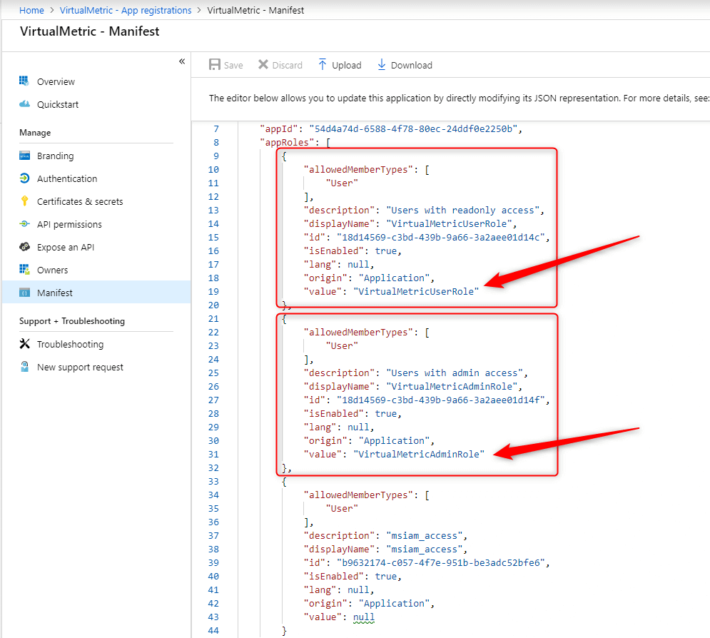
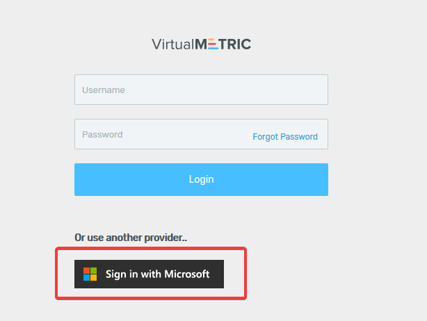

# Azure Active Directory Integration

VirtualMetric supports Azure Active Directory authentication for user authentications.

You can allow access to your Azure Active Directory users by configuring **"App Registration"** in your Azure Active Directory, and enabling **azureStatus** in your ControlPanel web.config file.

1\.      First, go to ControlPanel web.config file:

```
C:\Program Files\VirtualMetric\ControlPanel\Web.config
```

2\.      Find **azureStatus** in the **appSettings** section and change it as **true and restart virtualmertic API from IIS Manager**:

```
    <appSettings>
    <add key="primaryApiUrl" value="https://api.virtualmetric.com/API/" />
    <add key="failoverApiUrl" value="" />
    <add key="triggerId" value="3080487f-f3f6-43e2-bd27-7f1886a12816" />
    <add key="apiUser" value="vmapi" />
    <add key="apiPassword" value="727c9b3a51eb3407c7cc21c45d84bb28" />
    <add key="azureStatus" value="true" />
    </appSettings>
```

3\.      After enabling azureStatus in web.config file, you will see "Sign in with Microsoft" button on the logon screen:

<div align="left">

<figure><figcaption></figcaption></figure>

</div>

4\.      Now you need to register application in Azure Portal. You can follow the steps below to create Application Registration.

5\.      Click on Microsoft Entra ID

<div align="left">

<figure><figcaption></figcaption></figure>

</div>

6\.      Navigate to App Registrations and click **New Registration** button.

<div align="left">

<figure><figcaption></figcaption></figure>

</div>

7\.      Type your application name and select an account type. You need to type VirtualMetric API address for the Redirect URI. You can complete the registration by clicking Register button.

<div align="left">

<figure><figcaption></figcaption></figure>

</div>


Please make sure to enable SSL on VirtualMetric API and use https FQDN on RedirectURI Parameter. You can check [Setup SSL Certificate on VirtualMetric](../installation/maintenance.md#setup-ssl-certificate) section to read how to activate SSL.


8\.      After Application Registration, please enable **"Access Token"** and **"ID Token"** grants under **Authentication** options.

<div align="left">

<figure><figcaption></figcaption></figure>

</div>

9\.      Please add email optimal claim under **token configuration.**&#x20;

<div align="left">

<figure><figcaption></figcaption></figure>

</div>

10\.      Add your role configuration under the **appRoles** section and save the manifest file.

<div align="left">

<figure><figcaption></figcaption></figure>

</div>

Example configuration of the roles:

```json
"appRoles": [
	{
		"allowedMemberTypes": [
			"User"
		],
		"description": "Users with readonly access",
		"displayName": "VirtualMetricUserRole",
		"id": "18d14569-c3bd-439b-9a66-3a2aee01d14c",
		"isEnabled": true,
		"lang": null,
		"origin": "Application",
		"value": "VirtualMetricUserRole"
	},
	{
		"allowedMemberTypes": [
			"User"
		],
		"description": "Users with admin access",
		"displayName": "VirtualMetricAdminRole",
		"id": "18d14569-c3bd-439b-9a66-3a2aee01d14f",
		"isEnabled": true,
		"lang": null,
		"origin": "Application",
		"value": "VirtualMetricAdminRole"
	},
	{
		"allowedMemberTypes": [
			"User"
		],
		"description": "msiam_access",
		"displayName": "msiam_access",
		"id": "b9632174-c057-4f7e-951b-be3adc52bfe6",
		"isEnabled": true,
		"lang": null,
		"origin": "Application",
		"value": null
	}
],

```

11\.      Please note the **"Application (client) ID", "Directory (tenant) ID"** and **"RedirectURI"** parameters. You will update the appropriate fields in Advanced Settings.

<div align="left">

<figure><figcaption></figcaption></figure>

</div>

12\.      In the Advanced Settings, search for "Azure" and you will see the Azure Active Directory settings. Please set **Azure Active Directory Client ID, Azure Active Directory Tenant ID and Azure Active Directory Redirect Uri** variables.

Mapping should be like:&#x20;

| Advanced Settings Title             | Mapping Title           |
| ----------------------------------- | ----------------------- |
| Azure Active Directory Client ID    | Application (client) ID |
| Azure Active Directory Tenant ID    | Directory (tenant) ID   |
| Azure Active Directory Redirect Uri | RedirectURI             |


When a user wants to authenticate via Azure Active Directory, VirtualMetric looks for their email address.\
If AzureAD user and VirtualMetric user has the same email address, user will be authenticated automatically.\
Please check [Adding New User to VirtualMetric](users/user-operations/) section for more details.



**Visibility of Azure Active Directory Elements** should be **Active**


<div align="left">

<figure><figcaption></figcaption></figure>

</div>


After setting the parameters, you should reset the iis by **iisreset** on dashboard servers.&#x20;


13\.      Please create user groups on VirtualMetric under **Microsoft Azure -> User Groups**.&#x20;

<div align="left">

<figure><figcaption></figcaption></figure>

</div>

14\.      Please add the roles you have written to the manifest file.&#x20;

<div align="left">

<figure><figcaption></figcaption></figure>

</div>

15\.      Now let's go back to **Azure** and click on **Enterprise Applications**.

<div align="left">

<figure><figcaption></figcaption></figure>

</div>

15\.      Under **All Applications**, search for and click on the application related to VirtualMetric.

<div align="left">

<figure><figcaption></figcaption></figure>

</div>

16\.      Now we can add a user to the group and test it.

<div align="left">

<figure><figcaption></figcaption></figure>

</div>

16\.      Add your user and role then click on **assign**.

<div align="left">

<figure><figcaption></figcaption></figure>

</div>

17\.      Now you can navigate to Logon Screen to test your Azure Active Directory authentication. Please click **"Sign in with Microsoft"** button to redirect to Azure Active Directory authentication page.

<div align="left">

<figure><figcaption></figcaption></figure>

</div>

18\.      On your first login, you can grant access and login to VirtualMetric.

<div align="left">

<figure><figcaption></figcaption></figure>

</div>

19\.      Under the **Microsoft Azure -> User** section, you can see the users created with Azure.

<div align="left">

<figure><figcaption></figcaption></figure>

</div>
