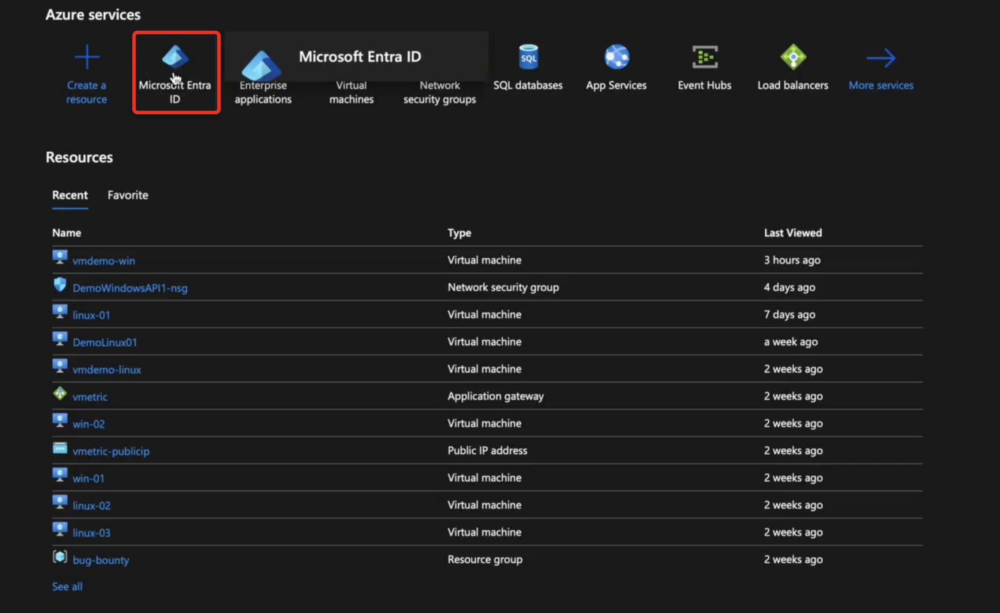
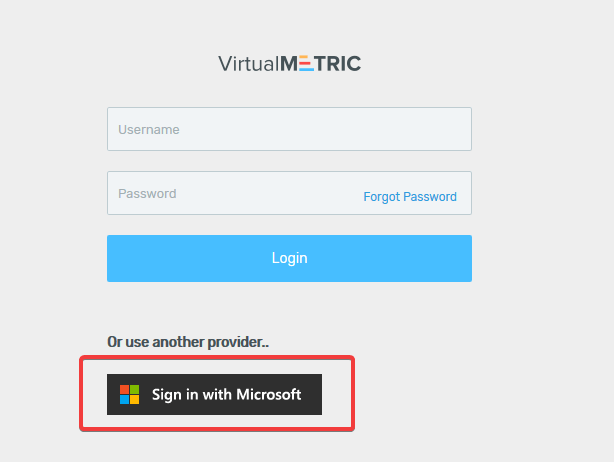

# Azure Active Directory Integration

VirtualMetric supports Azure Active Directory authentication for user authentications.

You can allow access to your Azure Active Directory users by configuring **"App Registration"** in your Azure Active Directory, and enabling **azureStatus** in your ControlPanel web.config file.

1\.      First, go to ControlPanel web.config file:

```
C:\Program Files\VirtualMetric\ControlPanel\Web.config
```

2\.      Find **azureStatus** in the **appSettings** section and change it as **true**:

```
    <appSettings>
    <add key="primaryApiUrl" value="https://api.virtualmetric.com/API/" />
    <add key="failoverApiUrl" value="" />
    <add key="triggerId" value="3080487f-f3f6-43e2-bd27-7f1886a12816" />
    <add key="apiUser" value="vmapi" />
    <add key="apiPassword" value="727c9b3a51eb3407c7cc21c45d84bb28" />
    <add key="azureStatus" value="true" />
    </appSettings>
```

3\.      After enabling azureStatus in web.config file, you will see "Sign in with Microsoft" button on the logon screen:

<div align="left">

<figure><figcaption></figcaption></figure>

</div>

4\.      Now you need to register application in Azure Portal. You can follow the steps below to create Application Registration.

5\.      Navigate to Azure Active Directory -> App Registrations and click **New Registration** button.

<div align="left">

<figure><figcaption></figcaption></figure>

</div>

6\.      Type your application name and select an account type. You need to type VirtualMetric API address for the Redirect URI. You can complete the registration by clicking Register button.

<div align="left">

<figure><figcaption></figcaption></figure>

</div>


Please make sure to enable SSL on VirtualMetric API and use https FQDN on RedirectURI Parameter. You can check [Setup SSL Certificate on VirtualMetric](../../installation/maintenance.md#setup-ssl-certificate) section to read how to activate SSL.


7\.      After Application Registration, please enable **"Access Token"** and **"ID Token"** grants under Authentication options.

<div align="left">

<figure><figcaption></figcaption></figure>

</div>

8\.      Please note the **"Application (client) ID", "Directory (tenant) ID"** and **"RedirectURI"** parameters. You will update the appropriate fields in Advanced Settings.

<div align="left">

<figure><figcaption></figcaption></figure>

</div>

9\.      In the Advanced Settings, search for "Azure" and you will see the Azure Active Directory settings. Please set **Azure Active Directory Client ID, Azure Active Directory Tenant ID and Azure Active Directory Redirect Uri** variables.

Mapping should be like:&#x20;

| Advanced Settings Title             | Mapping Title           |
| ----------------------------------- | ----------------------- |
| Azure Active Directory Client ID    | Application (client) ID |
| Azure Active Directory Tenant ID    | Directory (tenant) ID   |
| Azure Active Directory Redirect Uri | RedirectURI             |


When a user wants to authenticate via Azure Active Directory, VirtualMetric looks for their email address.\
If AzureAD user and VirtualMetric user has the same email address, user will be authenticated automatically.\
Please check [Adding New User to VirtualMetric](../users/user-operations/) section for more details.


10\.      Now you can navigate to Logon Screen to test your Azure Active Directory authentication. Please click **"Sign in with Microsoft"** button to redirect to Azure Active Directory authentication page.

<div align="left">

<figure><figcaption></figcaption></figure>

</div>

11\.      On your first login, you can grant access and login to VirtualMetric.

<div align="left">

<figure><figcaption></figcaption></figure>

</div>

