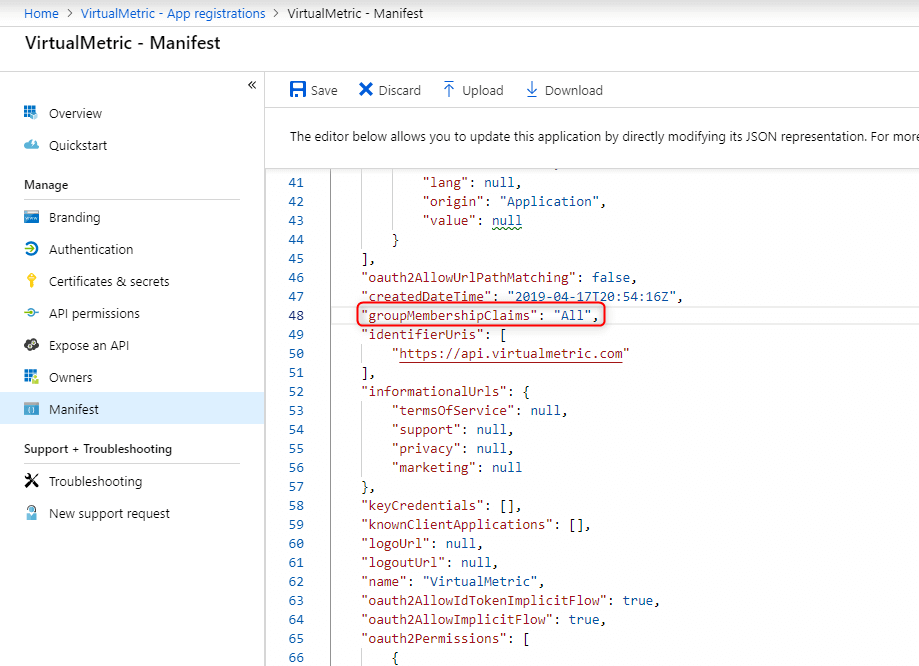
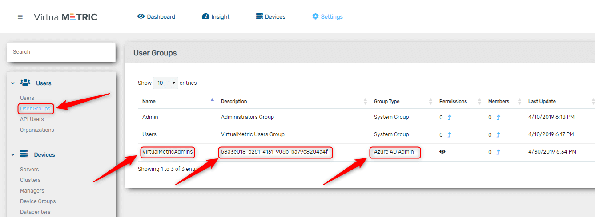
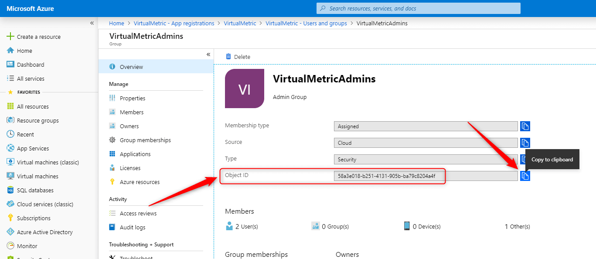
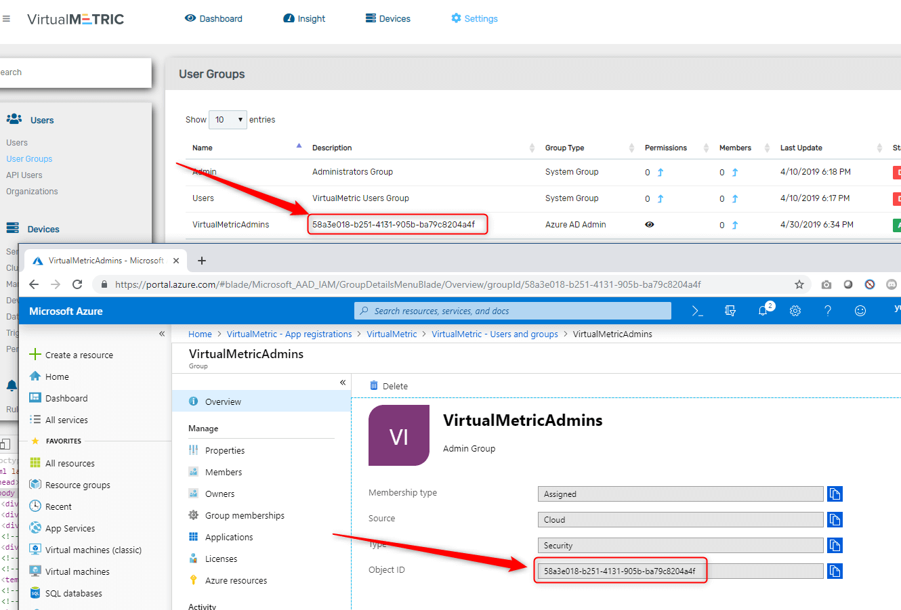

# Group Based Authentication

By default, VirtualMetric uses email addresses to match users with Azure Active Directory users. You can also allow Azure AD users to logon VirtualMetric by their group names.

1\.      First of all, please make sure that Azure Active Directory Anonymous User Access is enabled in the Advanced Settings.

<figure><figcaption></figcaption></figure>

2\.      Click on the application name to navigate application settings.

<figure><figcaption></figcaption></figure>

3\.      Make sure that you have your Azure Active Directory groups under the Users and groups section.

<figure><figcaption></figcaption></figure>

4\.      Please go back to App registrations page and click on Manifest menu.

<figure><figcaption></figcaption></figure>

5\.      Change groupMembershipClaims key as All and save the manifest file.

<figure><figcaption></figcaption></figure>

6\.      You can add your groups under the **User Groups** section.

<figure><figcaption></figcaption></figure>

7\.      You should select an Azure Group Type for your user group.\
\
There are 3 available Azure Group Types:

* Azure AD Admin: Users will have admin privileges
* Azure AD User: Users will have basic privileges
* Azure AD Read Only: Users will have read only privileges

8\.      You can select your Azure Group Type via Role field.

<figure><figcaption></figcaption></figure>

9\.      Please go to Azure AD Group overview and copy Object ID field.

<figure><figcaption></figcaption></figure>

10\.      Please make sure that user group Description field should match with Object ID in Azure AD.

<figure><figcaption></figcaption></figure>

