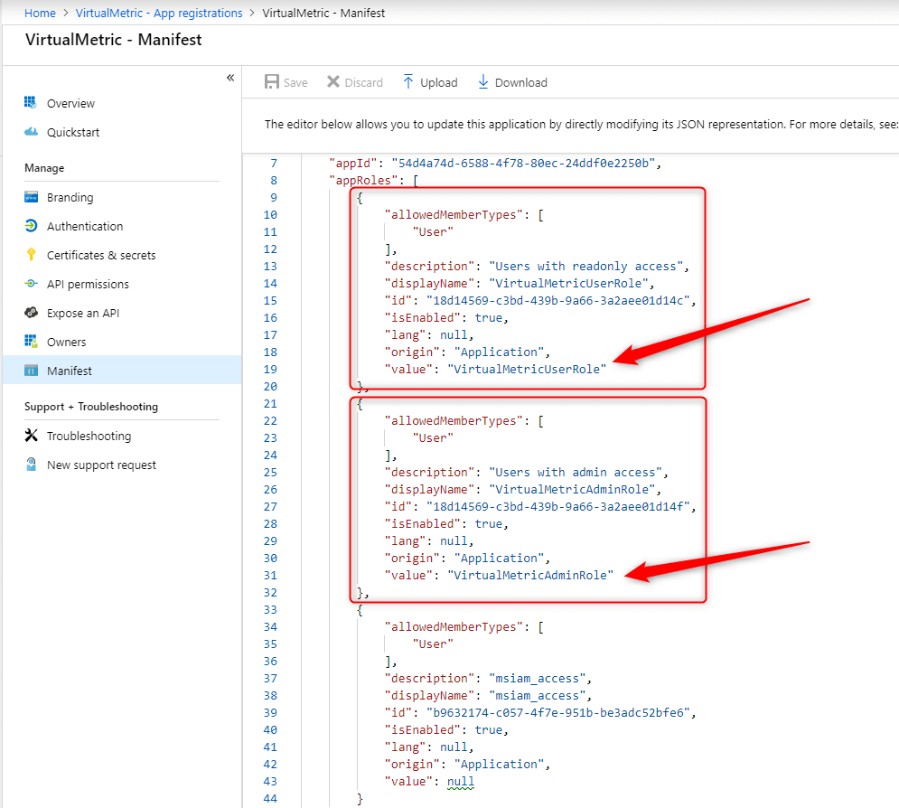

# Role Based Authentication

By default, VirtualMetric uses email addresses to match users with Azure Active Directory users. You can also allow Azure AD users to logon VirtualMetric by their role names.

1\.      First of all, please make sure that Azure **Active Directory Anonymous User Access** is enabled in the **Advanced Settings**.

<figure><figcaption></figcaption></figure>

2\.      Click on the application name to navigate application settings.

<figure><figcaption></figcaption></figure>

3\.      Make sure that you have your Azure Active Directory groups under the **Users and groups** section.

<figure><figcaption></figcaption></figure>

4\.      Please go back to App registrations page and click on **Manifest** menu.

<div align="left">

<figure><figcaption></figcaption></figure>

</div>

5\.      Add your role configuration under the **appRoles** section and save the manifest file.

<div align="left">

<figure><figcaption></figcaption></figure>

</div>

Example configuration of the roles:

```json
"appRoles": [
	{
		"allowedMemberTypes": [
			"User"
		],
		"description": "Users with readonly access",
		"displayName": "VirtualMetricUserRole",
		"id": "18d14569-c3bd-439b-9a66-3a2aee01d14c",
		"isEnabled": true,
		"lang": null,
		"origin": "Application",
		"value": "VirtualMetricUserRole"
	},
	{
		"allowedMemberTypes": [
			"User"
		],
		"description": "Users with admin access",
		"displayName": "VirtualMetricAdminRole",
		"id": "18d14569-c3bd-439b-9a66-3a2aee01d14f",
		"isEnabled": true,
		"lang": null,
		"origin": "Application",
		"value": "VirtualMetricAdminRole"
	},
	{
		"allowedMemberTypes": [
			"User"
		],
		"description": "msiam_access",
		"displayName": "msiam_access",
		"id": "b9632174-c057-4f7e-951b-be3adc52bfe6",
		"isEnabled": true,
		"lang": null,
		"origin": "Application",
		"value": null
	}
],

```

6\.      Please go back to app settings so you can assign these roles to groups. Please make sure that you see your roles under the Role Assigned tab.

<figure><figcaption></figcaption></figure>

7\.      You can add your groups under the User Groups section.

<figure><figcaption></figcaption></figure>

8\.      You should select an **Azure Group Type** for your user group.

<figure><figcaption></figcaption></figure>

There are 3 available Azure Group Types:

* **Azure AD Admin:** Users will have admin priviliges
* **Azure AD User:** Users will have basic priviliges
* **Azure AD Read Only:** Users will have read only priviliges

9\.      You can select your Azure Group Type via Role field.

<div align="left">

<figure><figcaption></figcaption></figure>

</div>

10\.      Please make sure that User Group names should match with **Role Assigned** names.
